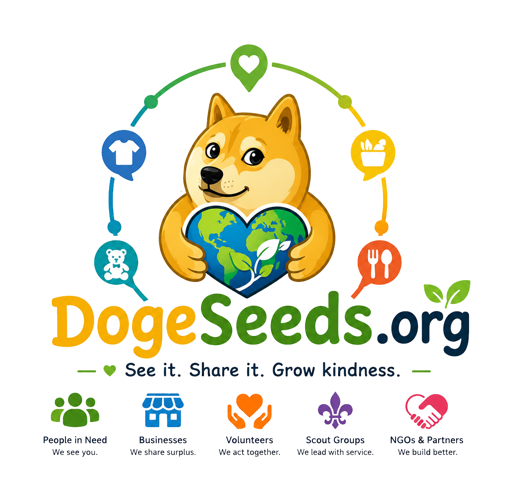

<p align="center">
  
</p>
<p align="center">
  <a href="https://foundation.dogecoin.com">
    
  </a>
</p>

<h1 align="center">DogeSeeds.org</h1>

<p align="center">
  <strong>See it. Share it. Grow kindness.</strong><br>
  A global map connecting people who need help with those who can share surplus food, clothing, toys, and essentials.
</p>

<p align="center">
  <a href="https://dogeseeds.org"><strong>🌐 Live site: dogeseeds.org</strong></a>
  &nbsp;·&nbsp;
  <span title="Early release">Beta</span>
</p>

<p align="center">
  <em>Do Only Good Everyday</em> — built with the Dogecoin community in mind, as part of the <strong>Dogecoin Foundation</strong> mission to spread kindness worldwide.
</p>

---

## What is DogeSeeds?

**DogeSeeds.org** is a mobile-first, map-based platform where individuals, farmers, stores, scout groups, volunteer teams, and NGOs can show what they **offer** or **need** — food, clothing, toys, and essentials — so neighbours can find each other quickly.

The live project runs at **[https://dogeseeds.org](https://dogeseeds.org)**.

- **Find help** — browse the map or list view, filter by category, use “Near me”
- **Share surplus** — register, add your place on the map, set pickup windows
- **Connect** — public inquiry form on listings; shareable friendly URLs for social media
- **Support the project** — optional Dogecoin donations for hosting and verified distribution (not personal profit)

---

## How it works

```
Visitor / neighbour          Registered user / org              Admin
        │                              │                            │
        ▼                              ▼                            ▼
   Open map at              Create account → onboarding          wow/ panel
   dogeseeds.org            wizard → add listing                 site settings,
        │                    (org type, offers/needs,             SMTP, DOGE wallet,
        ▼                     location, photo)                   languages
   Filter by category
   or tap a marker
        │
        ▼
   Popup preview →
   full detail panel →
   inquiry / share link
```

### Main pieces

| Layer | What it does |
|-------|----------------|
| **Frontend** | `index.php` + `assets/js/app.js` — Leaflet map, list view, onboarding, auth, sharing |
| **API** | `api/` — JSON REST (`map`, `organizations`, `auth`, `my/listings`, `listing-inquiry`, …) |
| **Database** | MySQL — users, organizations, locations, donations, settings |
| **i18n** | `lang/*.json` — UI strings; English fallback for missing keys |
| **Pretty URLs** | `.htaccess` — e.g. `dogeseeds.org/2-paulo/giving/clothing` opens that listing on the map |

### Organization types

Individuals, farmers/fishermen, supermarkets, restaurants, cafés, NGOs, scout groups, and volunteer hubs — each with a distinct map marker colour and icon.

### Categories

`food` · `clothing` · `toys` · `essentials`

### Share URLs

Each listing gets a slug like `{user_id}-{name}` (e.g. `2-paulo`). Share links look like:

`https://dogeseeds.org/2-paulo/giving/clothing`

Set **Site URL** in admin so OG/Twitter previews and copied links use the correct domain.

---

## Minimum requirements

| Requirement | Minimum |
|-------------|---------|
| **PHP** | 8.0+ |
| **Database** | MySQL 5.7+ or MariaDB 10.3+ |
| **PHP extensions** | `pdo`, `pdo_mysql`, `json`, `session` |
| **Web server** | Apache with `mod_rewrite` (recommended) or Nginx with equivalent rules |
| **Disk** | ~50 MB + space for uploaded listing photos (`uploads/locations/`) |
| **HTTPS** | Strongly recommended (geolocation, secure cookies, social previews) |

Optional but useful: SMTP for registration, password reset, and listing inquiry emails.

---

## Installation

Full step-by-step guide: **[INSTALL.md](INSTALL.md)**

### Quick start (new installation)

**You do not need migration SQL files for a fresh install.** The install wizard imports `database/schema.sql`, which already includes the full current database structure.

1. **Upload** all project files to your web root (`public_html` or equivalent).
2. **Create** a MySQL database and user with full privileges.
3. **Ensure** `config/` is writable (`chmod 755`).
4. **Visit** `https://yourdomain.com/install/` and complete the wizard.
5. **Delete** or block the `install/` folder when finished.
6. In **admin** (`/wow/`), set **Site URL** to your public URL (e.g. `https://dogeseeds.org`).

### Optional sample data

After install, you can optionally populate the map with worldwide sample NGOs, scouts, and volunteer hubs:

**phpMyAdmin** → select your database → **Import** → `database/seed-global-orgs.sql`

This is optional. Skip it if you prefer an empty map and will add real listings yourself.

### Upgrading an existing site only

The `database/migrate-v*.sql` files are **only for sites that were installed before a schema change**. If you are setting up DogeSeeds for the first time, ignore them.

If you upgraded from an older deployment, run any missing migration files in order in phpMyAdmin: `migrate-v2.sql` through `migrate-v10.sql`.

---

## How to use

### As a visitor (no account)

1. Open [dogeseeds.org](https://dogeseeds.org).
2. Use category filters or **Near me** to find nearby listings.
3. Tap a map marker for a preview; open full details for address, pickup window, and contact options.
4. Send an inquiry to the listing owner when contact is public.

### As someone sharing or seeking help

1. **Register** (free account).
2. Complete the **onboarding** wizard (who you are, what you offer or need).
3. **Add a place** on the map — name, location, photo, categories, pickup times.
4. Manage listings under **My listings** (edit, deactivate, add donation items).

### As an admin

1. Log in with an admin account.
2. Open **`/wow/`** (admin panel).
3. Configure site name, URL, default language, map defaults, Dogecoin wallet, SMTP, and transparency note.

---

## Project structure

```
dogeseeds/
├── index.php              # Main app (map, list, auth, onboarding)
├── .htaccess              # API routing + pretty share URLs
├── api/                   # REST API
│   ├── index.php          # Router
│   ├── map.php
│   ├── organizations.php
│   ├── auth.php
│   ├── my-listings.php
│   ├── listing-inquiry.php
│   └── admin/
├── assets/
│   ├── css/style.css
│   ├── js/app.js
│   └── img/               # Logo, card, Dogecoin Foundation mark
├── config/                # config.php (created by installer)
├── database/
│   ├── schema.sql         # Fresh install (used by wizard)
│   ├── migrate-v*.sql     # Existing sites only — not for new installs
│   └── seed-global-orgs.sql  # Optional sample map data
├── includes/              # PHP core (Auth, I18n, Mailer, helpers)
├── install/               # Web install wizard
├── lang/                  # Translation JSON files
├── uploads/locations/     # Listing photos (created on upload)
├── wow/                   # Admin panel
├── reset.php              # Password reset page
└── verify.php             # Email verification
```

---

## Tech stack

- **Backend:** PHP 8+, MySQL
- **Frontend:** Vanilla HTML/CSS/JS (no build step)
- **Map:** [Leaflet](https://leafletjs.com/) + CARTO/OSM tiles
- **Fonts:** Nunito + Material Icons
- **i18n:** JSON language files with English fallback

---

## Contributing — how to help improve it

We welcome issues and pull requests on GitHub. Ways to help:

1. **Report bugs** — include browser, steps to reproduce, and console/network errors if possible.
2. **Suggest features** — especially around accessibility, map UX, and community safety.
3. **Translate** — add or improve language files (see below).
4. **Code** — keep changes focused; match existing PHP/JS style; test on a local or staging install.
5. **Documentation** — improve INSTALL.md or this README.
6. **Test deployments** — shared hosting (cPanel), Nginx, different PHP versions.

### Development tips

- API routes are defined in `api/index.php`.
- UI strings must go in **all** `lang/*.json` files or at least `en.json` (others fall back to English).
- After changing share URL or asset path logic, test a nested URL like `/slug/giving/food`.
- Do not commit `config/config.php`, `.env`, or real credentials.

### Pull request checklist

- [ ] Works on PHP 8.0+
- [ ] No secrets in the diff
- [ ] New UI text added to `lang/en.json` (and other langs if you can)
- [ ] If schema changes: new `database/migrate-vN.sql` file

---

## Adding a new translation

DogeSeeds currently ships with **English, Portuguese, Spanish, French, German, Chinese, and Japanese**. To add or extend a language:

### 1. Create the language file

Copy the English template:

```bash
cp lang/en.json lang/xx.json
```

Replace `xx` with a two-letter (or common) code, e.g. `it` for Italian.

### 2. Translate every key

Each key in `lang/en.json` is a UI string. Translate the **values**, not the keys:

```json
{
  "site_name": "DogeSeeds.org",
  "nav_map": "Map",
  "nav_list": "List"
}
```

Some strings use `printf`-style placeholders — keep `%s` exactly as-is:

```json
"share_desc_giving": "%s is sharing %s on DogeSeeds — find it on the map."
```

### 3. Register the language

Add an entry to `includes/languages.php`:

```php
'it' => ['label' => 'Italiano', 'short' => 'IT', 'flag' => 'it'],
```

- `label` — shown in the language menu  
- `short` — compact code on mobile  
- `flag` — ISO country code for [flagcdn.com](https://flagcdn.com) icons  

### 4. Test

1. Visit `https://yoursite/?lang=it` (or use the language picker).
2. Walk through map, login, onboarding, listing detail, and share panel.
3. Missing keys automatically fall back to English (`includes/I18n.php`).

### 5. Open a pull request

- One file per language: `lang/xx.json`
- Update `includes/languages.php`
- Mention your language in the PR description

---

## Dogecoin & the Foundation

DogeSeeds is built in the spirit of **Do Only Good Everyday** and is associated with the **Dogecoin Foundation** mission of kindness and community impact.

- Donations are **DOGE only**, configured in admin.
- Funds are intended for **hosting and verified distribution** — not personal profit.
- The Dogecoin Foundation mark is included in `assets/img/dogecoin-foundation.svg`.

---

## License

Built for community good. Use responsibly and help others.

---

<p align="center">
  <strong><a href="https://dogeseeds.org">dogeseeds.org</a></strong> — Do Only Good Everyday
</p>
